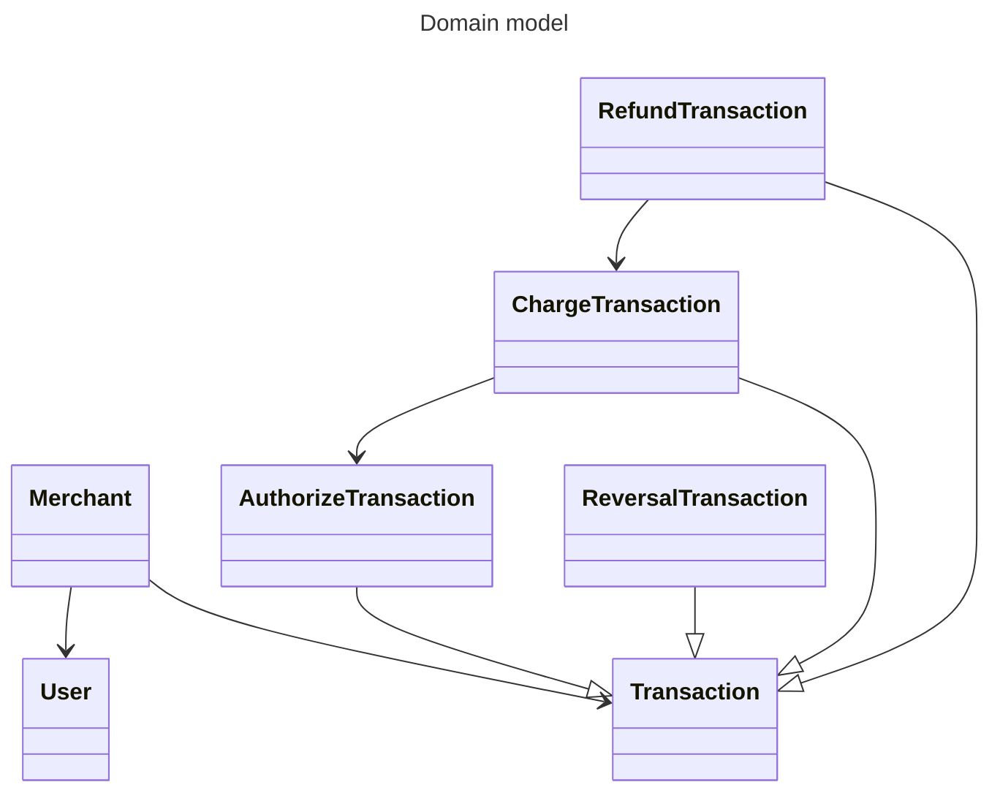
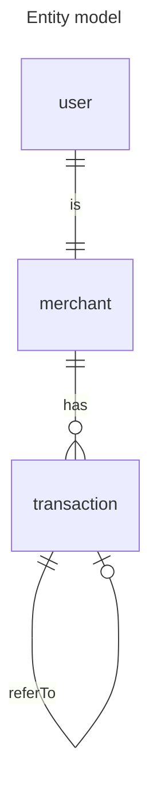

# emp-gw-task []

# Conceptual payment service

## Overview

The aim of this project is to demonstrate how to implement a simple service in professional way.
The service is a payment service that allows registered users to create payments transactions. The
most important technologies used for the implementation are:

- Java 17
- Spring Boot
- Spring Data
- Spring Security
- Spring Web
- docker and docker-compose

## How to run

### Prerequisites

- Java 17
- Docker (optional)
- PostgreSQL server (optional if docker and docker-compose are used)
- node (required for the frontend)

### Run with docker-compose

The easiest way to run the service is to use docker-compose. The 2 docker-compose files are located
in the root directory of the project.

#### docker-compose-dev.yml - this file is used to run the service in development mode

It will start
postgresql server accessible on localhost:5432. The database is initialized with the schema during
service startup. In this mode the service can be started form IDE or from command line using
`mvn spring-boot:run` command from project root.

```
docker-compose -f docker-compose-dev.yml up
mvn spring-boot:run
```

#### docker-compose-test.yml - this file is used to run the service in test/demo mode

It will start everything needed to test the service.

```
docker-compose -f docker-compose-test.yml up
```

The service will be accessible on localhost:8080.

### Run without docker (PostgreSQL server is required)

Make the necessary changes in application.properties file to point to your database server. Then

```
mvn spring-boot:run
```

The service will be accessible on localhost:8080.

### Run the frontend

The frontend is implemented using React. To run the frontend you need to have node installed. Then
go to frontend directory and run:

```
npm install
npm run dev
```

The frontend will be accessible on localhost:3000

## What we have inside

### Domain model



### Entity model



### REST API

#### MerchantController - /merchant

| Method | Path  | Data                     | Description        |
|--------|-------|--------------------------|--------------------|
| POST   | /     | json body                | create merchant    |
| GET    | /{id} | -                        | get merchant by id |
| PATCH  | /{id} | map<string, object> body | update merchant    |
| DELETE | /{id} | -                        | delete merchant    |

#### TransactionController - /transaction

| Method | Path | Data      | Description        |
|--------|------|-----------|--------------------|
| POST   | /    | json body | create transaction |

### Implementation details

#### Security

The service is secured with Basic Authentication. The users are stored in the database. The password
is stored in encrypted form using the best algorithm available in Java. The passwords are not
exposed in any way. The passwords are not logged. The migration of the cryptographic algorithm is
supported out of the box when new better algorithm is available in Java the new passwords are
encrypt by using the new algorithm.
Implemented roles are:

- merchant - can create transactions
- admin - can do everything

#### Database layer

Spring Data JPA is used to access the database. The database schema is created automatically during
service startup. The schema is versioned using Liquibase. Every change in the schema is versioned
and is implemented as a code.

#### Business logic

The business logic is implemented in the service layer. The service layer is covered with unit
tests.

#### REST API layer

The REST API layer is implemented as a thin layer covered with integration tests. The
integration tests are implemented using Spring MockMvc. The tests are using database running in
test containers to make sure that the tests are independent of the environment.

#### Continuous Integration

Continuous Integration is implemented using Github Actions. The build is triggered on every push to
the repository. Quality checks are implemented using SonarCloud. The CI also include static security
analysis using Snyk.

#### Coding style

Google Java Style is used as a coding style. The style is enforced using maven checkstyle plugin
and is checked by CI. During development automatic code formatting is supported by IDE.

#### Code quality checks

SonarCloud is used to check the code quality. The quality checks are implemented as part of CI.
As part of the quality checks the code coverage is checked. The code coverage is implemented using
Jacoco managed by maven. The coverage gate is set to 80% and is checked by CI.

#### Static security analysis

Snyk is used to check the code for known vulnerabilities. The check is implemented as part of CI.
When new vulnerability is found a PR with update of the dependencies is created automatically.

#### Git flow

There is only one protected branch - master. All changes are done in feature branches. The feature
branches are merged to master using PRs. The PRs are checked by CI. For clean history the PRs are
squashed in advance and merged when the PR checks are successful.

#### Github codespaces

A github codespace is configured to allow easy development of the service. The codespace is
configured to use Java 17 and maven. The codespace is configured to use PostgreSQL server running.

#### Continuous Delivery

Is not implemented yet.